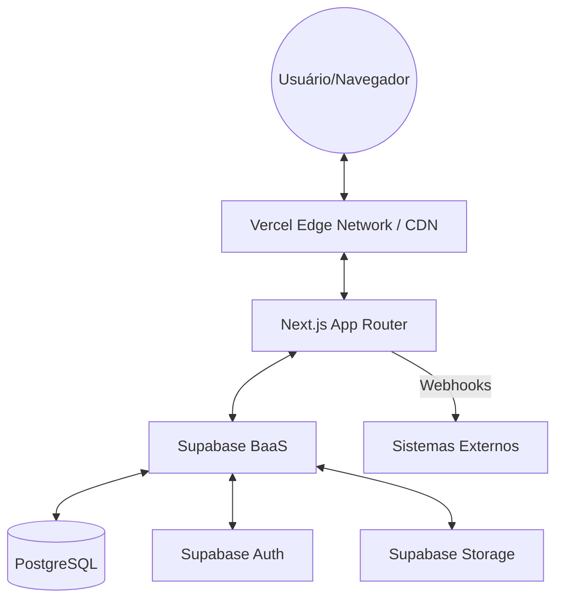
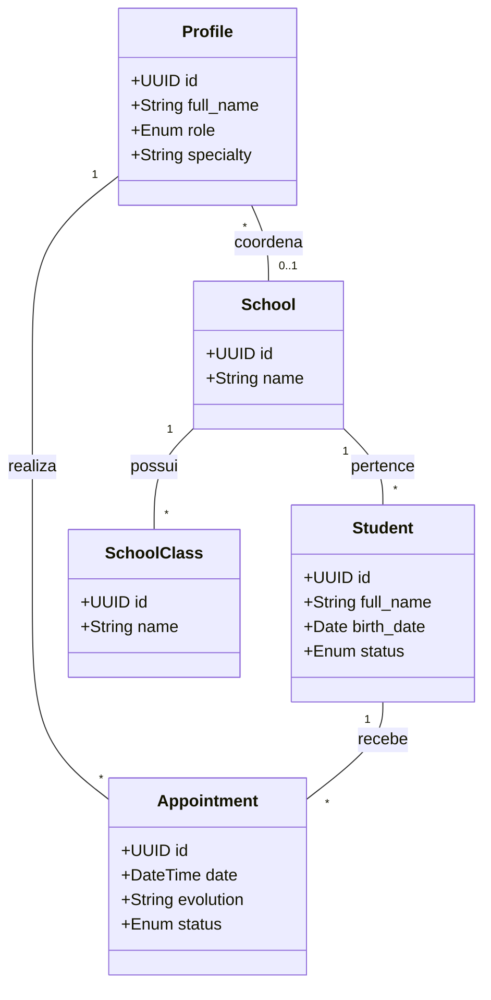
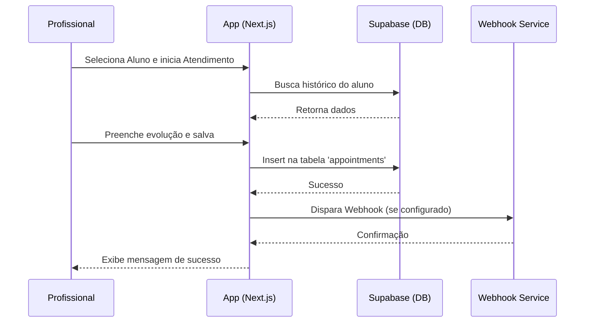

# 1. Arquitetura do Sistema

## 1.1 Arquitetura Geral
O sistema SAM utiliza uma arquitetura de aplicação web moderna baseada no padrão **Serverless Client-Side Rendering (CSR)** com suporte a **Server-Side Rendering (SSR)** via Next.js, comunicando-se diretamente com um **Backend-as-a-Service (BaaS)** (Supabase).

### Diagrama de Implantação


## 1.2 Arquitetura de Componentes
A aplicação está organizada em:
- **Camada de Visão (Pages/Components)**: Utiliza React e Tailwind CSS.
- **Camada de Lógica de Negócio (Actions)**: Server Actions do Next.js para mutações de dados.
- **Camada de Dados (Supabase Client)**: Abstração para chamadas ao banco de dados e autenticação.
- **Segurança (RLS)**: Regras de segurança aplicadas diretamente no banco de dados (Row Level Security).

## 1.3 Diagramas UML

### 1.3.1 Diagrama de Caso de Uso
```mermaid
useCaseDiagram
    actor "Administrador" as Admin
    actor "Profissional" as Prof
    actor "Coord. Escolar" as Coord

    Admin --> (Gerenciar Usuários)
    Admin --> (Configurar Instituição)
    Admin --> (Ver Logs de Auditoria)
    
    Prof --> (Gerenciar Alunos)
    Prof --> (Realizar Atendimento)
    Prof --> (Agendar Sessão)
    
    Coord --> (Consultar Alunos)
    Coord --> (Gerenciar Turmas)
    
    (Gerenciar Alunos) ..> (Login) : include
    (Realizar Atendimento) ..> (Login) : include
```

### 1.3.2 Diagrama de Classe (Simplificado)


### 1.3.3 Diagrama de Sequência (Fluxo de Atendimento)

